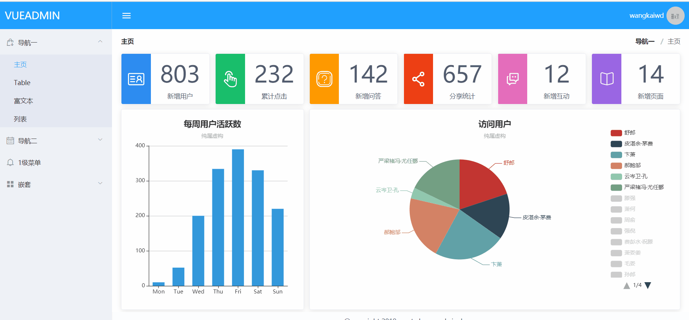
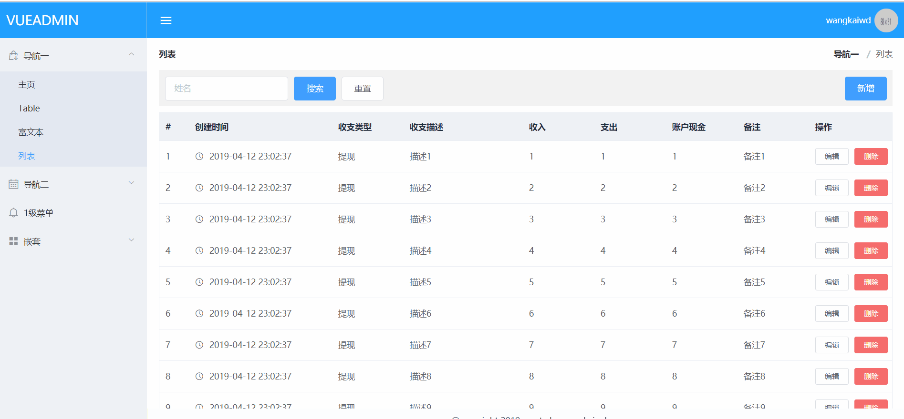

## `vue`项目实战小节
### 项目初衷
在最近的一段时间，一直负责公司的后台管理系统的开发和维护，整个技术栈涉及到`react + redux + redux-thunk + ant design`,并且将`react`升级到了`16.8`最新版本，尝试了`react hooks`的使用。之后自己也在`github`写了一个[`react`版本](https://github.com/wangkaiwd/react-create-app-kit)的后台管理系统的模板。

这之前一直有用`vue`写一些组件，但是却一直没有写过后台管理系统，所以这次既算是对`vue`写后管理系统的一次尝试，也是自己对后台管理系统相关业务需求和`vue`整体知识的一个总结，方便之后自己的复习和回顾，也希望能帮助到社区的小伙伴。
### 项目介绍
该项目是一个`vue`技术栈结合`express+mongodb`实现的一个后台管理系统，其中后台只是实现了登录注册等用户接口以及一个列表的增删改查。整个项目以前端为主，是一个通用的后台管理系统，并且集成了富文本、`echarts`并进行了二次封装。由于`element-ui`提供的`icon`图表较少，自己也在项目中加入了一个`AdminIcon`组件。

项目中的大多数需求都是根据自己工作中碰到需求的一个总结，有可能带有一些片面性，在使用的时候要根据自己的需求进行改进。项目中也通过几个真实的后台接口，真实模拟了一个简单的增删改查，在写登录注册时也对`jsonwebtoken`进行了简单实践，这也算是自己在后端接口方面的一个实战。

想要学习`node`的小伙伴可以点击这里:[`node`入门笔记](https://github.com/wangkaiwd/nodejs-relevant/blob/master/nodeBase/readme.md)，这是我在网上整理的一份`node`入门笔记，喜欢的可以`star`。

项目截图： 



#### 项目启动
```npm
git clone git@github.com:wangkaiwd/vue-admin.git
cd vue-admin
# 启动项目
yarn
yarn start

# 打包
yarn build:test
yarn build:pro

# 打包文件分析
yarn build:analyze
```
注意事项：
* 本地开发的话可以结合对应的真实接口来使用，接口`dmoe`我写到了另外一个仓库：https://github.com/wangkaiwd/node-interface-demo。  
* 使用真实接口开发的话要更换`axios`的`baseURL`,并在`vue.config.js`中配置服务代理
#### 项目技术栈
前端是以`vue`为主的技术栈，包括如下：  
* `vue`
* `vue-router`
* `vuex`

后端是以`express`为主结合`mongodb`数据库完成：  
* `express`
* `mongodb`
#### 项目依赖
* [`axios`](https://github.com/axios/axios):基于`Promise`的`http`客户端，用于浏览器和`node.js`
* [`qs`](https://github.com/ljharb/qs):支持解析嵌套的`querystring`。通俗来讲就是可以将以`key1=val1&key2=val2&...`格式的字符串转换为对象格式`{key1:val1,key2:val2,...}` 
* [`elemente ui`](http://element-cn.eleme.io/#/zh-CN/component/installation):基于`Vue 2.0`的桌面端组件库
* [`dayjs`](https://github.com/iamkun/dayjs): 一个轻量的日期处理库，用法和`moment.js`类似
* [`countup.js`](https://inorganik.github.io/countUp.js/): 一个有趣的数字动画库
* [`wangeditor`](http://www.wangeditor.com/): 基于javascript和css开发的 Web富文本编辑器， 轻量、简洁、易用、开源免费
* [`echarts`](https://echarts.baidu.com/tutorial.html#5%20%E5%88%86%E9%92%9F%E4%B8%8A%E6%89%8B%20ECharts):一个使用 JavaScript 实现的开源可视化库
#### 参考`demo`
参考了社区优秀的`vue-admin`项目，给各位大佬`star`:   
* [`vue-element-admin`](https://github.com/PanJiaChen/vue-element-admin)
* [`vue-admin-template`](https://github.com/PanJiaChen/vue-admin-template)
* [`vue-admin`](https://github.com/taylorchen709/vue-admin)
### 实现功能
* 后台接口
    - [x] 登录
    - [x] 注册
    - [x] 退出
    - [x] 使用`token`实现身份认证
    - [x] 列表数据(增、删、改、查、分页)
    - [ ] 图片上传
* `vue`组件封装
    - [x] 富文本组件(图片上传暂未实现)
    - [x] `echarts`组件
    - [x] 区域分割组件
* 项目模块
    - [x] `axios`请求封装
    - [x] `list`页面增删改查`demo`
    - [x] 左侧导航栏收缩
    - [x] `mock`数据接入
